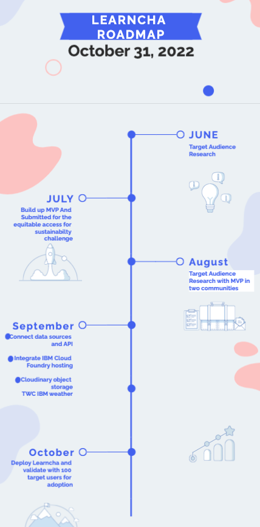

# Learncha

_Read this in other languages: [English](README.md), [한국어](./docs/README.ko.md), [português](./docs/README.pt_br.md), [中文](./docs/README.zh.md)._ 

## Contents

- [Submission or project name](#submission-or-project-name)
  - [Contents](#contents)
  - [Short description](#short-description)
    - [What's the problem?](#whats-the-problem)
    - [How can technology help?](#how-can-technology-help)
    - [The idea](#the-idea)
  - [Demo video](#demo-video)
  - [The architecture](#the-architecture)
  - [Long description](#long-description)
  - [Project roadmap](#project-roadmap)
  - [Getting started](#getting-started)
  - [Live demo](#live-demo)
  - [Built with](#built-with)
  - [Contributing](#contributing)
  - [Versioning](#versioning)
  - [Authors](#authors)
  - [License](#license)

## Short description
Learncha is an online and offline learning resources and a more immersive learning platform for kids using gaming to teach children in remote communities on climate and at same time have access to equitable educational tools and STEM games to enhance outside classroom learning
### What's the problem?

 - According to UNICEF Even though primary education is officially free and compulsory, about 10.5 million of the country’s children aged 5-14 years are not in school ?!

- The education deprivation in northern Nigeria is driven by various factors, including economic barriers, climatic, socio-cultural norms and practices that 
discourage attendance in formal education, especially for girls.

### How can technology help?

Schools and teachers can continue to engage with their students through virtual classrooms, and even create interactive spaces for classes. As parents face a new situation where they may need to homeschool their children, finding appropriate online resources is important as well.

### The idea

Learncha is an online and offline learning resources and a more immersive learning platform for kids using gaming to teach children in remote communities on climate and at same time have access to equitable educational tools and STEM games to enhance outside classroom learning

## Demo video

## The architecture

.png)

1. The user navigates to the site and uploads a video file.
2. Watson Speech to Text processes the audio and extracts the text.
3. Watson Translation (optionally) can translate the text to the desired language.
4. The app stores the translated text as a document within Object Storage.

## Long description

[More detail is available here](./docs/DESCRIPTION.md)

## Project roadmap

##### Learncha currently does the following:
- online and offline learning resources
- immersive learning platform for kids using gaming to teach children in remote communities on climate
- A climate challenge can be created and get people around the world to join and solve climate problems around the world.
#### it currently runs on IBM Cloud Foundary.
#### See below for our proposed schedule on next steps after Call for Code 2021 submission.

## Getting started

In this section you add the instructions to run your project on your local machine for development and testing purposes. You can also add instructions on how to deploy the project in production.

- [sample-react-app](./sample-react-app/)
- [sample-angular-app](./sample-angular-app/)
- [Explore other projects](https://github.com/upkarlidder/ibmhacks)

## Live demo

You can find a running system to test at [learncha.vercel.app](https://learncha.vercel.app).

See the "long description" field in our submission (not in this repo) for the log-in credentials.

## Built with
Online
- [IBM Cloud Foundary](https://www.ibm.com/sa-en/cloud/cloud-foundry) - Used for hosting
- [IBM The Weather Company](https://www.ibm.com/products/weather-company-data-packages) - Weather API used for climate challenge
- [PostgreSQL](https://www.postgresql.org/) - Database management system
- [Cloudinary](https://cloudinary.com/documentation) - Object Storage
- [FASTAPI](https://fastapi.tiangolo.com/) - Python Web API used 
- [ROME](https://rometools.github.io/rome/) - Used to generate RSS Feeds

Offline
- [trivia API](https://the-trivia-api.com/) - API used for Trivia quiz
- [Dictionary API](https://api.dictionaryapi.dev/api/v2/entries/en/word) - Used to fetch meaning of words
- [MySQL]() - Database management system used
- [Thesaurus API](https://api.api-ninjas.com/v1/thesaurus?word=<word>) - APi used to fetch Thesaurus

## Contributing

Please read [CONTRIBUTING.md](CONTRIBUTING.md) for details on our code of conduct, and the process for submitting pull requests to us.

## Versioning

We use [SemVer](http://semver.org/) for versioning.

## License

This project is licensed under the Apache 2 License - see the [LICENSE](LICENSE) file for details.

