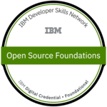

# Submission or project name

  

A basic GitHub repository example for new [Call for Code](https://developer.ibm.com/callforcode/) projects and those that join the Call for Code with The Linux Foundation deployment initiative. Not all sections or files are required. You can make this as simple or as in-depth as you need. And don't forget to [join the Call for Code community](https://developer.ibm.com/callforcode/solutions/projects/get-started/).

> If you're new to open source, please consider taking the [free "Introduction to Open Source" class](https://cognitiveclass.ai/courses/introduction-to-open-source).
> 
> 

_Read this in other languages: [English](README.md), [한국어](./docs/README.ko.md), [português](./docs/README.pt_br.md), [中文](./docs/README.zh.md)._ 

## Contents

- [Submission or project name](#submission-or-project-name)
  - [Contents](#contents)
  - [Short description](#short-description)
    - [What's the problem?](#whats-the-problem)
    - [How can technology help?](#how-can-technology-help)
    - [The idea](#the-idea)
  - [Demo video](#demo-video)
  - [The architecture](#the-architecture)
  - [Long description](#long-description)
  - [Project roadmap](#project-roadmap)
  - [Getting started](#getting-started)
  - [Live demo](#live-demo)
  - [Built with](#built-with)
  - [Contributing](#contributing)
  - [Versioning](#versioning)
  - [Authors](#authors)
  - [License](#license)
  - [Acknowledgments](#acknowledgments)

## Short description
Learncha is an online and offline learning resources and a more immersive learning platform for kids using gaming to teach children in remote communities on climate and at same time have access to equitable educational tools and STEM games to enhance outside classroom learning
### What's the problem?

 - According to UNICEF Even though primary education is officially free and compulsory, about 10.5 million of the country’s children aged 5-14 years are not in school ?!

- The education deprivation in northern Nigeria is driven by various factors, including economic barriers, climatic, socio-cultural norms and practices that 
discourage attendance in formal education, especially for girls.

### How can technology help?

Schools and teachers can continue to engage with their students through virtual classrooms, and even create interactive spaces for classes. As parents face a new situation where they may need to homeschool their children, finding appropriate online resources is important as well.

### The idea

Learncha is an online and offline learning resources and a more immersive learning platform for kids using gaming to teach children in remote communities on climate and at same time have access to equitable educational tools and STEM games to enhance outside classroom learning

## Demo video

## The architecture

1. The user navigates to the site and uploads a video file.
2. Watson Speech to Text processes the audio and extracts the text.
3. Watson Translation (optionally) can translate the text to the desired language.
4. The app stores the translated text as a document within Object Storage.

## Long description

[More detail is available here](./docs/DESCRIPTION.md)

## Project roadmap

##### Learncha currently does the following:
- online and offline learning resources
- immersive learning platform for kids using gaming to teach children in remote communities on climate
- A climate challenge can be created and get people around the world to join and solve climate problems around the world.
#### it currently runs on IBM Cloud Foundary.
#### See below for our proposed schedule on next steps after Call for Code 2021 submission.

## Getting started

In this section you add the instructions to run your project on your local machine for development and testing purposes. You can also add instructions on how to deploy the project in production.

- [sample-react-app](./sample-react-app/)
- [sample-angular-app](./sample-angular-app/)
- [Explore other projects](https://github.com/upkarlidder/ibmhacks)

## Live demo

You can find a running system to test at [callforcode.mybluemix.net](http://callforcode.mybluemix.net/).

See the "long description" field in our submission (not in this repo) for the log-in credentials.

## Built with

- [IBM Cloudant](https://cloud.ibm.com/catalog?search=cloudant#search_results) - The NoSQL database used
- [IBM Cloud Functions](https://cloud.ibm.com/catalog?search=cloud%20functions#search_results) - The compute platform for handing logic
- [IBM API Connect](https://cloud.ibm.com/catalog?search=api%20connect#search_results) - The web framework used
- [Dropwizard](http://www.dropwizard.io/1.0.2/docs/) - The web framework used
- [Maven](https://maven.apache.org/) - Dependency management
- [ROME](https://rometools.github.io/rome/) - Used to generate RSS Feeds

## Contributing

Please read [CONTRIBUTING.md](CONTRIBUTING.md) for details on our code of conduct, and the process for submitting pull requests to us.

## Versioning

We use [SemVer](http://semver.org/) for versioning. For the versions available, see the [tags on this repository](https://github.com/your/project/tags).

## Authors

- **Billie Thompson** - _Initial work_ - [PurpleBooth](https://github.com/PurpleBooth)

## License

This project is licensed under the Apache 2 License - see the [LICENSE](LICENSE) file for details.

## Acknowledgments

- Based on [Billie Thompson's README template](https://gist.github.com/PurpleBooth/109311bb0361f32d87a2).
